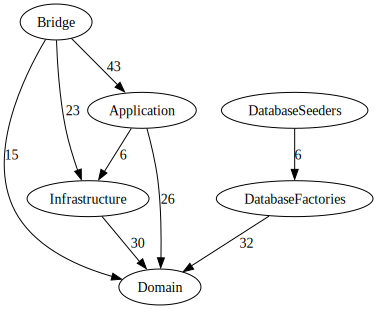

<br>

<div align="center">


</div>

<br>

<br>

<div align="center">
<a href="https://actions-badge.atrox.dev/wayofdev/laravel-cycle-starter-tpl/goto"></a>
<a href="https://github.com/wayofdev/laravel-cycle-starter-tpl/tags"></a>
<a href="LICENSE.md"></a>
<a href="#"></a>
<a href="https://app.codecov.io/gh/wayofdev/laravel-cycle-starter-tpl">
</a>
</div>

<br>

# Laravel Cycle ORM Starter Template

This is an **opinionated** modified version of the Laravel framework which aims at providing a Domain-Driven Design (DDD) structure and using [CycleORM](https://cycle-orm.dev) instead of Eloquent.

## 📄 About

Laravel is a popular PHP web framework known for its simplicity, elegance and the Active Record ORM - Eloquent. Despite its popularity and convenience, Eloquent often comes in the way of projects that require a Domain-Driven Design (DDD) structure. This is due to Eloquent's active record pattern, which in practice can cause the violation of DDD principles, most notably the separation of the business logic from infrastructure code.

Understanding this challenge, we've introduced CycleORM in place of Eloquent in this starter template. CycleORM offers a DataMapper pattern which is a better fit for DDD as it helps to maintain a clear boundary between your business logic and database. This approach ensures that your domain rules and business logic can be modelled according to your needs, and not around the constraints of the active record pattern.

This repository provides a modified file structure for Laravel that follows DDD principles and tries to adhere to best practices, such as those outlined in Spatie's Laravel Beyond CRUD.

Our goal is to provide a starting point for building Laravel applications using a DDD approach with CycleORM, while still leveraging the power and convenience of the Laravel framework.

<br>

🙏 If you find this repository useful, consider giving it a ⭐️. Thank you!

<br>

## 🚀 Features

This starter template inherits the following features from its upstream template [wayofdev/laravel-starter-tpl](https://github.com/wayofdev/laravel-starter-tpl):

* **Added:**
  * Strict types declaration in all PHP files
  * Style checker package for custom rule-sets to php-cs-fixer — [wayofdev/php-cs-fixer-config](https://github.com/wayofdev/php-cs-fixer-config)
  * Static analysis tool — [PHPStan](https://phpstan.org) and it's extensions:
    * [phpstan/extension-installer](https://github.com/phpstan/extension-installer) — automatic installation of PHPStan extensions
    * [phpstan/phpstan-deprecation-rules](https://github.com/phpstan/phpstan-deprecation-rules) — rules for detecting usage of deprecated classes, methods, properties, constants and traits.
    * [nunomaduro/larastan](https://github.com/nunomaduro/larastan) — PHPStan integration with Laravel
  * [Pest](https://pestphp.com) testing framework
  * Github action workflows for:
    * Continuous integration which includes coding standards checks, unit testing and static analysis
    * Automatic pull-request labeling
    * [Deployer](https://deployer.org) for automatic deployments to staging and production servers with support of [Github Environments](https://docs.github.com/en/actions/deployment/targeting-different-environments/using-environments-for-deployment)
  * [ergebnis/composer-normalize](https://github.com/ergebnis/composer-normalize) composer plugin for normalizing composer.json file
  * [roave/securityadvisories](https://github.com/Roave/SecurityAdvisories) package to ensure that application doesn't have installed dependencies with known security vulnerabilities.
  * Application dockerization using docker-compose and Makefile — use `make help` to view available commands
  * Git pre-commit hooks using [pre-commit](https://pre-commit.com) package
* **Changed:**
  * Marked default Laravel classes as `final`
  * Modified file structure to meet DDD principles
  * Changed config folder files to use default PHP multi-line comment style
* **Removed:**
  * Dependencies like Laravel Sanctum, Laravel Pint, and Laravel Sail.
  * Broadcasting service provider and it's routes. It can be added back, if it will be required for project
  * Console routes in favor of Command classes.
  * Sanctum migration files

Following the inherited features, this starter template also introduces a set of additional modifications from the upstream template, [wayofdev/laravel-starter-tpl](https://github.com/wayofdev/laravel-starter-tpl):

* **Added:**
  * CycleORM support via [wayofdev/laravel-cycle-orm-adapter](https://github.com/wayofdev/laravel-cycle-orm-adapter) - This introduces the DataMapper pattern, which is more compatible with DDD principles, replacing Laravel's default Eloquent ORM which uses the Active Record pattern.
* **Changed:**
  * Deployer script uses custom task to run Cycle ORM migrations instead of Eloquent migrations
* **Removed:**
  * Default Laravel Eloquent migrations - As we're using CycleORM, the default Eloquent migrations are no longer necessary and have been removed to prevent conflicts.

<br>

## 🚩 Requirements

To use this repository, you need to meet the following requirements:

- **macOS** Monterey+ or **Linux**
- Docker 20.10 or newer
  - [How To Install and Use Docker on Ubuntu 22.04](https://www.digitalocean.com/community/tutorials/how-to-install-and-use-docker-on-ubuntu-22-04)
- Installed **dnsmasq** service, running in the system. You can use [ansible-role-dnsmasq](https://github.com/wayofdev/ansible-role-dnsmasq) to install and configure this service.
- **Cloned, configured and running** [docker-shared-services](https://github.com/wayofdev/docker-shared-services) to support system-wide DNS, routing, and TLS support via Traefik.

<br>

## 💿 Installation

> Warning: You should configure, set up, and run the [docker-shared-services](https://github.com/wayofdev/docker-shared-services) repository to ensure system-wide TLS and DNS support.

1. **Clone** repository:

   After forking or creating generating repository from template, you can clone it to your local machine. In this example we will use `laravel-cycle-starter-tpl` repository as starting point.

   ```bash
   $ git clone git@github.com:wayofdev/laravel-cycle-starter-tpl.git
   ```

2. **Generate** `.env` file

   Generate .env file from .env.example file using Makefile command:

   ```bash
   $ make env \
       APP_NAME=laravel \
       SHARED_SERVICES_NAMESPACE=ss \
       PROJECT_SERVICES_NAMESPACE=wod \
       COMPOSE_PROJECT_NAME=laravel-cycle-starter-tpl
   ```

   **Change** generated `.env` file to match your needs, if needed.

   (Optional): to re-generate `.env` file, add `FORCE=true` to the end of command:

   ```bash
   $ make env \
       APP_NAME=laravel \
       SHARED_SERVICES_NAMESPACE=ss \
       PROJECT_SERVICES_NAMESPACE=wod \
       COMPOSE_PROJECT_NAME=laravel-cycle-starter-tpl \
       FORCE=true
   ```

3. **Build**, install and run. This will also generate Laravel app key:

   ```bash
   $ make

   # or run commands separately
   $ make hooks
   $ make install
   $ make key
   $ make prepare
   $ make up
   ```

<br>

## 🤝 License

[](./LICENSE)

<br>

## 🧱 Credits and Useful Resources

Useful resources about Laravel and DDD approach:

* [Laravel Beyond CRUD](https://spatie.be/products/laravel-beyond-crud)
* [Laravel Skeleton](https://romanzipp.github.io/Laravel-Skeleton/) by [romanzipp](https://github.com/romanzipp)
* [Using Deptrac to maintain code quality](https://getparthenon.com/blog/using-deptrac-to-maintain-code-quality/)

<br>

## 🙆🏼‍♂️ Author Information

This repository was created in **2023** by [lotyp / wayofdev](https://github.com/wayofdev).

<br>

## 🙌 Want to Contribute?

Thank you for considering contributing to the wayofdev community!
We are open to all kinds of contributions. If you want to:

- 🤔 Suggest a feature
- 🐛 Report an issue
- 📖 Improve documentation
- 👨‍💻 Contribute to the code

<br>

## 🧰 Project Architecture

This project uses Domain-Driven Design (DDD) principles and is structured into four main layers: Domain, Application, Bridge, and Infrastructure. Each layer has specific responsibilities and dependencies, as described below.

### → Layers

* **Domain:**

  The Domain layer is the core of our business software, and it encapsulates the business rules. This involves entities, value objects, aggregates, events, and domain services.

  <ins>The Domain layer does not depend on any other layer</ins>, thereby preserving the integrity and independence of the business logic.

* **Application:**

  The Application layer orchestrates the coordination of domain objects to perform specific use cases of our application. This includes things like application services and command/query handlers.

  This layer depends on the Domain layer for business rules and the Infrastructure layer for technical capabilities.

* **Bridge:**

  The Bridge layer is the adapter that allows our application to interact with the outside world. It uses Laravel to route HTTP requests or console commands to the corresponding Application layer use case.

  This layer depends on the Application layer, Domain layer, and Infrastructure layer. It uses the Application layer to orchestrate operations, the Domain layer for domain knowledge, and the Infrastructure layer for technical capabilities.

* **Infrastructure:**

  The Infrastructure layer provides generic technical capabilities to support the higher layers. This includes things like database access, file system access, and other technical concerns.

  This layer can depend on the Domain layer, meaning it can use domain entities, value objects, or services when implementing its technical concerns.

For more information check [deptrac.yaml](https://github.com/wayofdev/laravel-cycle-starter-tpl/blob/develop/app/deptrac.yaml) located in repository `app` folder.

### → Architecture Rules

These layer dependencies are enforced using the Deptrac tool, which checks the codebase for violations of our architecture rules. The rules are defined in the [deptrac.yaml](https://github.com/wayofdev/laravel-cycle-starter-tpl/blob/develop/app/deptrac.yaml) file and specify that:

- The **Domain** layer **does not** depend on any other layer.
- The **Application** layer **depends** on the **Domain** and **Infrastructure** layers.
- The **Bridge** layer depends on the **Domain**, **Application**, and **Infrastructure** layers.
- The **Infrastructure** layer depends on the **Domain** layer.

By adhering to these rules, we can ensure a clean separation of concerns in our application, with the business logic (Domain) kept separate from use case orchestration (Application), communication with the outside world (Bridge), and technical concerns (Infrastructure).

### → Dependency Tracking using Deptrac

We use Deptrac to enforce a clean architecture within our codebase. Deptrac helps us adhere to the principles of layered architecture by defining and checking rules that describe which parts of our code can depend on others.

Deptrac operates on the level of PHP classes, analyzing the dependencies between them and comparing them to the architecture rules defined in [deptrac.yaml](https://github.com/wayofdev/laravel-cycle-starter-tpl/blob/develop/app/deptrac.yaml). If a class has a dependency that violates these rules, Deptrac will alert us.

Using Deptrac allows us to ensure a clean separation of concerns in our codebase, making it easier to understand, test, and maintain.

* To generate images from deptrac dependency `graphviz` needs to be installed on your system:

  ```bash
  $ brew install graphviz
  ```

* Running deptrac

  To run Deptrac and check for violations of our architecture rules, you can use one of the following commands:

  ```bash
  $ make lint-deps
  ```

  or navigate to the repository's app directory and execute:

  ```bash
  $ cd app
  $ composer deptrac
  ```

  This will run Deptrac and report any violations in the console output.

  To create a visual graph of our dependencies, you can run:

  ```bash
  $ composer deptrac:gv
  ```

  This command will generate an image in the `assets` directory.

### → Architecture Diagram



<br>
